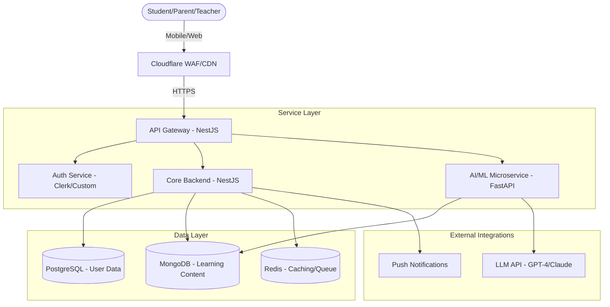

# Study Buddy: Technical Blueprint & Project Implementation Plan

This document outlines the definitive, production-ready blueprint for **Study Buddy**, an AI-powered EdTech platform.

## Executive Summary
Study Buddy is designed to optimize high school learning through AI-driven personalization. This blueprint focuses on scalability (2M+ users), security (Aman), and high performance (Cepat & Ringan).

---

## PHASE 1: High-Level System Architecture & Tech Stack

### Tech Stack Selection
| Layer | Technology | Justification |
| :--- | :--- | :--- |
| **Mobile Frontend** | **Flutter** | Unified codebase for iOS/Android, native-like performance, and rich UI capabilities (essential for premium feel). |
| **Admin/Web** | **Next.js** | SEO-friendly, fast initial loads, and React-based for complex teacher/parent dashboards. |
| **Core API Gateway** | **Node.js (NestJS)** | High concurrency handling, TypeScript support for reliability, and extensive ecosystem. Starting as a **Modular Monolith** for streamlined development. |
| **AI/ML Service** | **Python (FastAPI)** | Industry standard for ML (Scikit-learn, PyTorch). FastAPI for high-performance inference. |
| **LLM Provider** | **Google Gemini** | Native integration for high-performance Socratic tutoring and auto-grading. |
| **Primary DB** | **PostgreSQL** | Relational data integrity for users, grades, and enrollments. |
| **Content DB** | **MongoDB** | Flexible schema for diverse learning materials, practice questions, and AI-generated content. |
| **Caching/Real-time** | **Redis** | Sub-millisecond latency for session management, leaderboard data, and frequency-limited API requests. |

### Architecture Diagram

### Database Schema Strategy
- **Relational (PostgreSQL)**: `Users`, `Profiles`, `SubscriptionPlans`, `Enrollments`, `AuditLogs`.
- **Document (MongoDB)**: `StudyMaterials`, `QuizBanks`, `LLM_Interactions`, `VAK_Results`.
- **Cache (Redis)**: User sessions, top-ranking leaderboards, and rate-limiting counters.

---

## PHASE 2: AI & Machine Learning Implementation Strategy

### 1. VAK Classification (KNN)
- **Data Ingestion**: A 20-question psychometric survey. Responses mapped to numerical vectors (0-1).
- **Normalization**: Standardize inputs to ensure equal weight for each question.
- **Model**: Scikit-learn's `KNeighborsClassifier` trained on validated VAK datasets.
- **Inference**: Triggered once per semester or upon user request to recalibrate.

### 2. Socratic Tutor (In-Quiz Hint System)
- **Concept**: Socratic Tutor is **NOT a standalone chat room**. It is an **integrated hint system** within the quiz/practice screen. When a student is stuck on a problem, they press a "Minta Bantuan AI" button to receive a Socratic-style leading question.
- **LLM Selection**: **Google Gemini (Pro/Flash)** for multimodal capabilities (analyzing the current problem + providing hints).
- **Prompt Template**: `You are a Socratic Tutor embedded in a quiz system. The student is working on problem #N. Never give the answer directly. Analyze the problem and ask ONE leading question to guide their thinking. Context: Indonesian High School curriculum (Kurikulum Merdeka/K13).`
- **Context-Aware**: The AI receives the current question, subject, difficulty, and student's previous wrong attempts to tailor its hint.
- **Latency**: Use **Streaming Responses** (Server-Sent Events) to provide immediate feedback.

### 3. Smart Schedule Scanner (Indonesian Priority)
- **Flow**: User uploads photo $\rightarrow$ **Google Cloud Vision OCR** $\rightarrow$ **Gemini Vision** (to handle unstructured hand-written schedules) $\rightarrow$ **Genetic Algorithm**.
- **Data Priority**: Prioritize training and parsing for Indonesian standard school hours (e.g., 07:00 - 15:30) and local subjects (IPA, IPS, Bahasa Indonesia).
    - *Constraints*: School hours, Sleep, Subject Difficulty (User-defined), Upcoming Exams.
    - *Objective Function**: Minimize cognitive load by spacing difficult subjects (Spaced Repetition).

---

## PHASE 3: Security, Privacy & Performance (The "Non-Negotiables")

### Data Security (Aman)
- **Encryption**: AES-256 for data at rest (DB level), TLS 1.3 for in-transit.
- **Minor Protection**: PII (Personally Identifiable Information) encryption. No data sharing with 3rd parties.
- **RBAC**: Multi-tenant isolation at the DB schema or row level.

### Performance Optimization (Cepat & Ringan)
- **Edge Caching**: Cloudflare KV for static learning modules.
- **State Management**: **Riverpod** (Flutter) for efficient UI rebuilds.
- **Background Jobs**: **BullMQ** (Redis-backed) for heavy OCR processing and report generation.

---

## PHASE 4: Phased Development Roadmap & Sprints

| Sprint | Goals | Key API Endpoints | Required Testing |
| :--- | :--- | :--- | :--- |
| **Weeks 1-2** | Foundation | `POST /auth/register`, `GET /profile` | Unit (Auth flows) |
| **Weeks 5-6** | AI Implementation | `POST /tutor/chat`, `POST /scanner/upload` | Integration (LLM/OCR) |
| **Weeks 7-8** | Launch Prep | `GET /leaderboard`, `POST /grades` | Load (100k+ users) |

---

## PHASE 5: Deployment & DevOps Workflow
- **CI/CD**: GitHub Actions workflow:
    1. Lint/Static Analysis.
    2. Unit Tests (Jest/Pytest).
    3. Build Docker Images.
    4. Deploy to Staging (K8s).
- **Monitoring**: **Sentry** for crash reporting, **Prometheus/Grafana** for resource metrics.

---

## CHECKER: Current State vs. Blueprint

| Feature | Blueprint Requirement | Current Status |
| :--- | :--- | :--- |
| **Tech Stack** | Flutter (Mobile) | [x] Flutter initialized (Boilerplate) |
| **Architecture** | Microservices/Modular | [ ] Not implemented (Single `lib/main.dart`) |
| **VAK Detection** | KNN Classifier | [ ] Not implemented |
| **Socratic AI** | In-Quiz Hint (LLM) | [x] Gemini API integrated (needs quiz UI) |
| **Schedule Scanner** | OCR + Genetic Algo | [ ] Not implemented |
| **Database** | Postgres/Mongo/Redis | [ ] No DB connections found |
| **Security** | RBAC/Encryption | [ ] Default "Flutter Demo" security |

> [!IMPORTANT]
> The project is currently at **0% functionality** beyond the default Flutter counter template. Transitioning to this blueprint requires a full refactoring of the current folder structure to support a scalable Clean Architecture.

## Open Questions
- [x] **LLM Provider**: Google Gemini.
- [x] **Architecture**: Modular Monolith.
- [x] **Schedules**: Indonesian High School (SMA/MA/SMK) priority.
